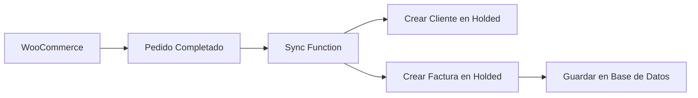

# 🧾 Integración con Holded - Sistema de Facturación

## 📋 Descripción

La integración con Holded permite automatizar la creación de facturas desde pedidos de WooCommerce, sincronizar clientes y gestionar todo el proceso de facturación de forma centralizada.

## 🔧 Configuración

### 1. Obtener API Key de Holded

1. Accede a tu cuenta de Holded
2. Ve a **Configuración** → **Más** → **Desarrolladores**
3. Copia la **API Key** o crea una nueva si no tienes

### 2. Configurar Variables de Entorno

Añade la siguiente variable a `supabase/functions/.env`:

```bash
# Holded API
HOLDED_API_KEY=tu_api_key_aqui
```

### 3. Configurar en la App

Ve a **Configuración** → **Sistema** → **Holded** y configura:
- **API Key**: Tu clave de API de Holded
- **Guardar** para aplicar los cambios

## 🚀 Funcionalidades

### 📦 Sincronización Automática

- **Pedidos de WooCommerce** → **Facturas en Holded**
- **Clientes automáticos**: Se crean en Holded si no existen
- **Productos sincronizados**: Items de pedidos convertidos a líneas de factura

### 🧾 Gestión de Facturas

- **Crear facturas** desde pedidos individuales
- **Estados de factura**: Borrador, Enviada, Pagada, Cancelada
- **Historial completo** de todas las facturas
- **Enlaces directos** a Holded para gestión avanzada

### 📊 Dashboard de Facturación

- **Estadísticas en tiempo real**: Borradores, Enviadas, Pagadas
- **Total facturado** acumulado
- **Filtros avanzados** por estado y cliente
- **Búsqueda** por nombre, email o ID de factura

## 🔄 Flujo de Trabajo

### 1. Sincronización de Pedidos



### 2. Creación Manual de Facturas

1. Ve a **Facturación** → **Pedidos sin Facturar**
2. Selecciona un pedido
3. Haz clic en **"Crear Factura"**
4. La factura se crea automáticamente en Holded

### 3. Gestión de Estados

- **Borrador**: Factura creada pero no enviada
- **Enviada**: Factura enviada al cliente
- **Pagada**: Factura marcada como pagada
- **Cancelada**: Factura cancelada

## 📱 Interfaz de Usuario

### Pestaña "Facturas"
- Lista de todas las facturas creadas
- Filtros por estado y búsqueda
- Cambio de estado de facturas
- Enlaces a Holded

### Pestaña "Pedidos sin Facturar"
- Lista de pedidos de WooCommerce sin factura
- Creación rápida de facturas
- Información del cliente y total

## 🔧 Edge Functions

### `create-holded-invoice`
Crea una factura individual en Holded desde un pedido.

**Parámetros:**
```json
{
  "order_id": "string",
  "customer_name": "string",
  "customer_email": "string",
  "customer_phone": "string",
  "items": [
    {
      "name": "string",
      "quantity": "number",
      "price": "number",
      "sku": "string"
    }
  ],
  "total": "number",
  "notes": "string"
}
```

### `sync-woocommerce-holded`
Sincroniza automáticamente pedidos completados de WooCommerce con Holded.

**Funcionalidades:**
- Obtiene pedidos completados de WooCommerce
- Crea clientes en Holded si no existen
- Genera facturas automáticamente
- Guarda todo en la base de datos local

## 📊 Base de Datos

### Tabla `invoices`
```sql
CREATE TABLE invoices (
  id UUID PRIMARY KEY DEFAULT gen_random_uuid(),
  order_id UUID REFERENCES orders(id),
  holded_invoice_id TEXT NOT NULL,
  customer_name TEXT NOT NULL,
  customer_email TEXT NOT NULL,
  customer_phone TEXT,
  total_amount DECIMAL(10,2) NOT NULL,
  status TEXT CHECK (status IN ('draft', 'sent', 'paid', 'cancelled')),
  items JSONB NOT NULL,
  notes TEXT,
  created_at TIMESTAMP WITH TIME ZONE DEFAULT NOW(),
  updated_at TIMESTAMP WITH TIME ZONE
);
```

## 🎯 Beneficios

### ✅ Automatización Completa
- Sin intervención manual para facturas básicas
- Sincronización en tiempo real
- Reducción de errores humanos

### ✅ Gestión Centralizada
- Todo en una sola interfaz
- Estados sincronizados
- Historial completo

### ✅ Integración Perfecta
- WooCommerce → Holded → App
- Flujo de datos bidireccional
- Notificaciones automáticas

## 🚨 Consideraciones

### Limitaciones de la API de Holded
- Algunas operaciones requieren plan premium
- Límites de rate limiting
- Campos específicos según configuración

### Mejores Prácticas
- Revisar facturas antes de enviar
- Mantener sincronización regular
- Backup de datos importantes

## 🔮 Próximas Mejoras

- [ ] Envío automático de facturas por email
- [ ] Plantillas personalizadas de factura
- [ ] Reportes de facturación avanzados
- [ ] Integración con métodos de pago
- [ ] Notificaciones de vencimiento

## 📞 Soporte

Para problemas con la integración:
1. Verifica las credenciales de Holded
2. Revisa los logs de Edge Functions
3. Confirma la configuración de WooCommerce
4. Contacta soporte técnico si es necesario

---

**¡La integración con Holded está lista para automatizar tu facturación!** 🎉
